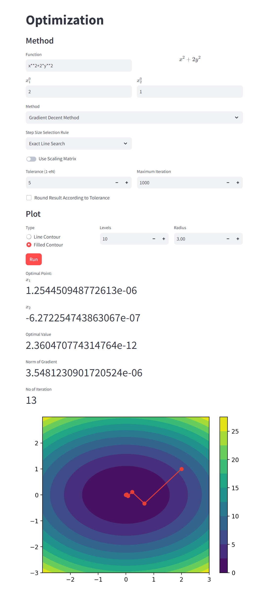

# Optimization Methods with Python

A Python implementation of various optimization methods for multidimensional functions using Streamlit with filled and line contour plot of optimization process. It's available online at [Optimization](https://optimization-app.streamlit.app/)



## Implemented Methods

Explore a selection of implemented methods, including:
- Gradient Descent with constant, exact line search and backtracing step size
- Scaled Gradient Descent with Diagonal Reversed Hessian and Custom Matrix
- Newton's Method
- Damped Newton's Method
- Hybrid Gradient-Newton Method

## Installation and Usage

1. Clone the repository:
   ```bash
   git clone https://github.com/mehdimhb/optimization.git
   ```

2. Change to the project directory:

    ```bash
    cd optimization
    ```

3. Install the required dependencies:

    ```bash
    pip install -r requirements.txt
    ```

4. Run the Streamlit app:

    ```bash
    streamlit run app.py
    ```

The application should now be accessible in your web browser at `http://localhost:8501`.

## Contributing

Contributions are always welcome! If you have any ideas or suggestions, please feel free to open an issue or a pull request.

## License

This project is licensed under the MIT License. See the [LICENSE](LICENSE) file for more information